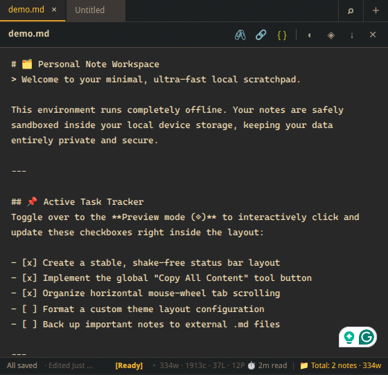

# Notepad — Browser Extension
> A minimal, persistent scratchpad that lives in your browser. No accounts, no sync, fully offline.

---

## Features

- Multi-tab notes with persistent local storage
- Markdown editor with live preview
- Interactive task list checkboxes
- Grab the active tab's title/URL — or a YouTube timestamp — directly into your note
- Search across all notes by title or content
- Export any note as `.md`
- Light/Dark theme (Gruvbox palette)
- Word, character, line, and reading time stats in the status bar
- Added important tag `!!Review DOM manipulation patterns!!`
- Added Info/Idea Block `((Refactor the task tracker script using localized numbers tomorrow))`
- Added date tag `26.06.2026` `<date>26/06/2026</date>`

## Shortcuts

| Shortcut | Action |
| :--- | :--- |
| **`Ctrl + T`** | Create a new note tab |
| **`Ctrl + P`** | Toggle view modes between Editor and Live Preview |
| **`Ctrl + F`** | Toggle global search interface (Title + Content filter) |
| **`Ctrl + D`** | Auto-stamp current localized date and time |
| **`Ctrl + B`** | Wrap text in bold markdown (`**text**`) |
| **`Ctrl + I`** | Wrap text in italic markdown (`*text*`) |
| **`Ctrl + Shift + X`** | Wrap text in strikethrough markdown (`~~text~~`) |
| **`Ctrl + Shift + C`** | Insert empty block syntax or wrap selection inside a code block |
| **`Ctrl + Shift + Y`** | **Smart Grab Tab:** Injects active tab title & link (grabs local timestamps if on YouTube) |
| **`Ctrl + E`** | Export the current text buffer out to a `.md` file |
| **`Ctrl + S`** | Force-trigger visual "Saved" validation status sync |
| **`Ctrl + Z`** / **`Ctrl + Y`** | Undo / Redo through debounced typing history blocks |
| **`Ctrl + Tab`** | Cycle rightward through open note tabs |
| **`Ctrl + Shift + Tab`**| Cycle leftward through open note tabs |
| **`Ctrl + Click`** | Open a detected markdown link cleanly inside a new browser tab |
| **`Escape`** *(In Search)* | Safely close the search filter interface |
| **`Tab`** | Injects code-compliant double space (`  `) indentation block |
| **`Enter`** | Automates continuous list markers (`-`, `*`, numbered, empty `[ ]` checkboxes) |

> This extension still in-progress